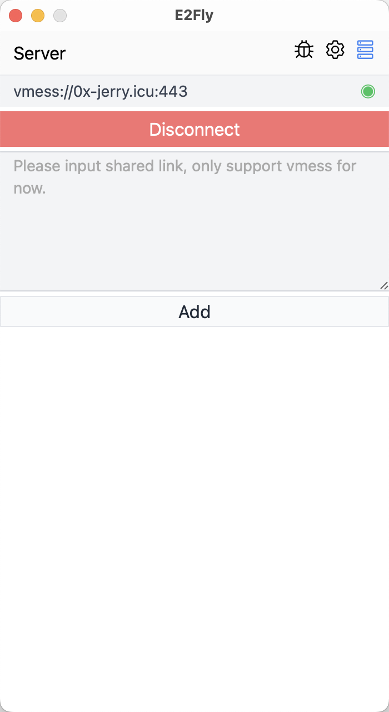
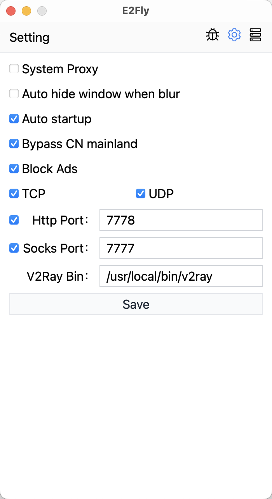
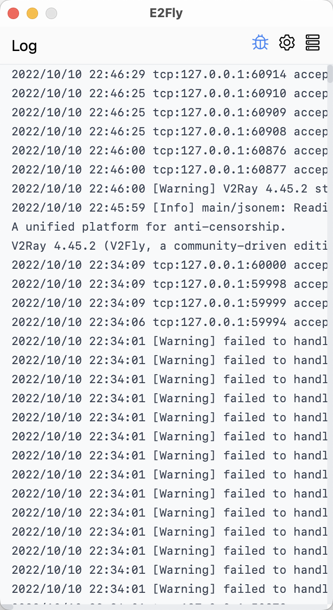

# E2Fly(WIP)

Another cross-platform [V2Ray] GUI client, support [xray]. WIP

## Feature

Em..., There are no excited features. It just works as expected.

## Screenshot

|                              |                              |                              |
| ---------------------------- | ---------------------------- | ---------------------------- |
|  |  |  |

## TODO

- [x] System proxy
- [x] TUN mode
- [x] Support Mac
- [x] Support Window
- [ ] Support Linux
- [ ] Support more protocol, current only support vmess/vless protocol
- [x] Auto update, [docs](https://tauri.app/v1/guides/distribution/updater)

## Migration

**`< 1.6.0` to `1.6.0`**

Because version `1.6.0` changed the app’s identifier, all configuration files need to be migrated manually.

You need to open the configuration folder before upgrading. Then upgrade the app to `1.6.0`. After the upgrade, you can copy all the files to the new configuration folder.

## Contribute

Any kinds of contribution are welcome.

[v2ray]: https://www.v2fly.org/
[xray]: https://xtls.github.io/
